# Motion Detection using Background Subtraction with OpenCV on a RaspberryPI

### Detecting Motion on a multi-use trail to monitor trail usage

Example Background Subtraction Mask

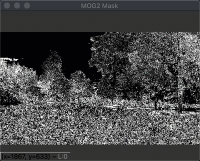

---
## Overview

In this project we are going to focus on using OpenCV for background subtraction to detect motion.

We can then use the information from the project in future projects where we need to detect motion before starting other processes.

While this project can be run on a laptop, the goal was to make the processing efficient enough to run on a RaspberryPI 4.

When running on the RPi4, no video was displayed, because the goal was to detect the motion and save some still captures.  

The final project was tested on a RPi4.  

## Introduction

In this first part, we are going to monitor trail usage by using 'Background Subtraction' to detect motion from video collected using a Nest cam.

Once we have detected motion on the trail, we want to capture some still images that we can review to determine the kind of trail usage.

As a little background on the setup, there is a fixed Nest camera facing the trail.  Clips were taken of ATV, bicycle and walkers using the trail.

The trail looks like the following:

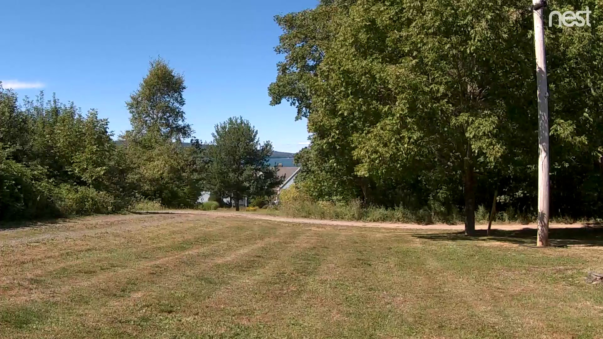

The goal is to monitor for motion along the trail and create still images of the motion for later review.

An aspect of background subtraction that makes it tricky for outdoor use, is that the background subtraction algorithm assumes that the background is stationary.  If there is any kind of wind, or shadow movement that will confuse the background subtraction algorithm.  Ideally we would like to remove or reduce the detected motion that is not on the trail.


## Why do we care about Background Subtraction

In the context of this project using a RaspberryPI we do not want to run the heavy cpu algorithms like Face Recognition or Object Recognition unless there is motion detected.

In this case, we would like a fast and efficient means of detecting motion, then start the heavy processing algorithms and when motion stops, also stop the heavy processing algorithms.  We also use the detection of motion to start capture a video feed or still images while there is motion.

The detection of motion is the key to knowing when something interesting is happending in the field of view, and detecting motion uses Background Subtraction.


## What is covered

* OpenCV Background Subtraction Algorithms

There are a number of different OpenCV algorithms.  This blog will look at a few of them but you are encouraged to try the others.  As you will see, it is simple to try others.

* View original video footage and the background subtraction mask

* Look at default algorithm parameters and some parameter adjustments

* Use erode and dilate transformations 

To reduce the background subtraction noise.  We will see that by removing the non-trail movement, the algorithm speeds up.  This is very important to resource constrained devices such as the RaspberryPI.

* Use LabelImg to create rectangular masks of 'Regions of Interest' or ROIs.

We will generate a PascalVOC formatted file of the regions along the path we would like to look for motion, and then mask out all other areas.  This significantly speeds up the algorithms as only a small portion of the video feed has to be inspected for motion.

Masking out ROI is not always required, or even desirable.  This will depend upon your use case.  For example, in part 2 where we create an facial recognition alarm system we do NOT mask out any regions.

* Save captured images in a background thread

* Save captures images to dropbox in a background thread

## Attribution

All information is discovered and learned from somewhere and someone else.  The information presented here is no different.  What led me to create this project was the [RaspberryPI for Computer Vision](https://www.pyimagesearch.com/raspberry-pi-for-computer-vision/) series by Dr. Adrian Rosebrock creator of the [PyimageSearch.com](https://pyimagesearch.com) website.

This project is inspired by the Hobbyist Bundle, 'Bird Feeder Monitor'.  Many of the examples in the Hobbyist bundle leverages background subtraction.  I decided to apply what I learned in the Hobbyist bundle to my problem of monitoring trail usage.

```text
@book{rosebrock_rpi4cv,
  author={Rosebrock, Adrian and Hoffman, Dave and McDuffee, David,
	and Thanki, Abhishek and Paul, Sayak},
  title={Raspberry Pi for Computer Vision},
  year={2019},
  edition={1.0.0},
  publisher={PyImageSearch.com}
}

```
If you are interested in Computer Vision particularly as it relates to the RaspberryPI you will not find a better resource, IMHO.

I was also inspired to include a Dropbox integration after reading this PyImageSearch Blog:

```text
Adrian Rosebrock, 
Home surveillance and motion detection with the Raspberry Pi, Python, OpenCV, and Dropbox, 
PyImageSearch, 
https://www.pyimagesearch.com/2015/06/01/home-surveillance-and-motion-detection-with-the-raspberry-pi-python-and-opencv/,
accessed on 10 January 2021

```

## OpenCV Background Subtraction

[OpenCV Background Subtraction](https://docs.opencv.org/3.4/d1/dc5/tutorial_background_subtraction.html)

Background Subtraction calculates a foreground mask, belonging to the moving objects in a scene, by performing a subtraction of the current frame from the background model.  The background model is created from the static parts of image along with a threshold.

Below is an image from the OpenCV documentation that describes this.


There are a number of [OpenCV algorithms](https://docs.opencv.org/4.5.0/df/d5d/namespacecv_1_1bgsegm.html).  

We will see later, this project is setup to allow for the following Background Subtractor (BS) algorithms:

* CNT

* GMG

* MOG

* GSOC

* LSBP

* MOG2

Specifically this project will look at a subset of these.

Using the BS classes is as easy as passing a frame from a video or webcam to the `apply` method of the class and the algorithm will return a mask.

How mask is created is dependent upon the algorithm selected and the parameters used.

For example:

```python
# pseudo code
backSub = cv2.bgsegm.createBackgroundSubtractorCNT()

while True:
    ret, frame = capture.read()
    if frame is None:
        break
    
    # call the apply method with the current frame and get the 
    # mask in return
    fgMask = backSub.apply(frame)
```

We will see that additional process of the mask is required to get good performance.

### Example Masks

We will take a look at 4 different BS algorithms and view the resulting mask.  Keep in mind this is using the default parameters for each algorithm and no other transformations have been applied yet.

The length of the clips is different because of the processing overhead.

Notice how each algorithm detects a different mask image representing motion - particularly in the trees.

#### GMG
One item to keep in mind with the GMG algorithm, is that by default it takes 120 frames to train the background.  This why it apparently sits idle then kicks.  This initialization frame size can be adjusted when creating the algorithm

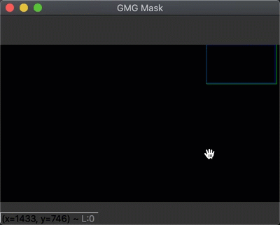

#### MOG2


#### MOG

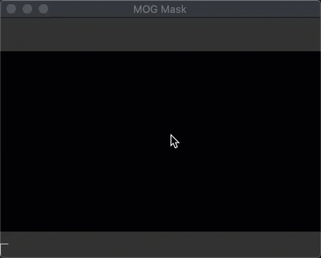

#### CNT


## Project Structure

### config

This directory contains configurations files.

* bg_subtract_config.json

Contains the final values that we are going to use.

* exp_bg_subtract_config.json

Contains the starting default values, and we will be changing this file as we go.

* motion_roi.xml

This is a PascalVOC formatted file from LabelImg tool.  It contains rectangles with regions of interest.  We will use this to mask out the 'ROuI' (regions of un-interest)

* rpi_bg_subtract_config.json

This configuration file is setup for the RPi and specifically turns off the display of the video as that kind of overhead is not suitable for the RPi.


* classes.txt

Another file generated from LabelImg

The interesting aspect of the configuration file is that they are JSON files but they contain
'C' like comments which is generally not allowed.  Using a package called json-minify, we can read in the file and strip the comments.

Hopefully the comments in the configuration file provide enough information about the parameter.

### media

This directory contains videos of the trail usage for ATV, bicycle and walkers.  

### utils

* conf.py

This class is dervied from the PyImageSearch `Conf` class.  This version allows for multiple configuration files to be read and also has a method to return the keys and return as a dictionary.  This class will handle reading the configuration files with 'C' like comments.

* BackgroundSubtractUtil.py

This class does all of the heavy lifting for OpenCV background subtraction.

The constructor takes a number of parameters, all with default values that essentially mimic creating the specified BackgroundSubtract algorithm with default values.

However, it can do much more.

#### erode, dilate

* erode_kernel, erode_iterations, dilate_kernel, dilate_iterations

These parameters will run post transformations on the background mask to 'group' together the detected movement.  Will transform fine grained motion movement in to macro level motion movement.  This will make it easier to detect large movement.  Doing this will make the radius and area  parameters below easier to filter 'noise'

#### Minimum size of motion contour

* min_radius, min_area_ratio

You can specify that the minimum radius or minimum area ratio ( area of rect of motion / area of frame) has to be of certain values for the movement to be considered.  This is a way to filter out small, noise, movement.

#### rectangles representing regions of interest to look for motion

* motion_roi_rects

In many cases, for example this one monitoring the trail, there are specific sections of the video image that are of interest.  You can provide rectangles that represent these areas and when an image is to be investigated for motion, first a mask is applied to only view the ROI rectangle exposed part of the image.  This can greatly reduce the false positive motion detection but also speed up the entire operation.

### main.py

This script is the main driver script that will read in the video file and frame by frame process it for motion.

## Progressive Background Subtraction Improvements

In this section we will use the algorithm: `cv2.bgsegm.createBackgroundSubtractorCNT` because it is a fast implementation and for the RaspberryPI we need cpu efficient algorithms.  MOG2 is another good - but really you need to experiment with different algorithms for you platform and usecase.

As you see above CNT algorithm, while it is fast, it also picks up a lot of 'noise' motion.  

We are going to apply some techniques using the CNT algorithm that can be used for any of the algorithms.
 
### Goal

Our goal is adjust algorithm parameters, opencv techniques, heuristics and additional masks such that the only time we detect motion will be along the trail as shown in the image above.

#### How to Measure Goal

We are going to measure the percentage of frames that detected motion.


### Default createBackgroundSubtractorCNT

`python main.py --video-file ./media/atv.mp4 --bg-config ./config/exp_bg_subtract_config.json`

You should see two windows appear and look something like below.

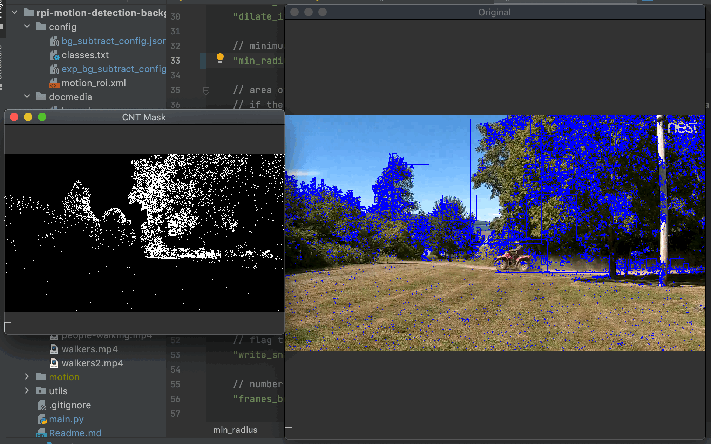

If you run to completion, you will see the following:

`Percentage of frames with motion: 100.00%`

Because the default settings for the CNT algorithm picked up movement in the trees it always detected motion.  However, we just want motion on the trail.

### erode and dilate

From the [OpenCV Docs](https://docs.opencv.org/3.4/db/df6/tutorial_erosion_dilatation.html)
```text
The most basic morphological operations are: 
  Erosion and Dilation. They have a wide array of uses, i.e. :
- Removing noise
- Isolation of individual elements and joining disparate elements in an image.
- Finding of intensity bumps or holes in an image

```

I encourage you to experiment with different values but we are going to use:

erode: 3x3 kernel
dilate: 5x5 kernel

We will see that the mask window has fewer and larger motion spots, and the number of detected motion rectangles in the image is smaller.

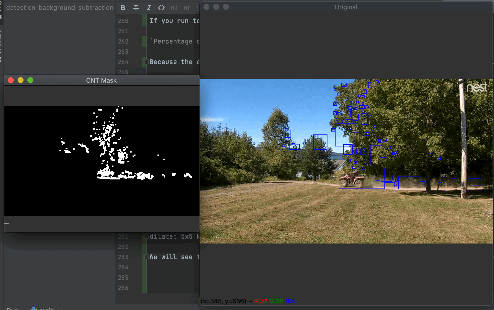

By apply `erode` and `dilate` transformations on the background mask, we can see that we significantly reduce the overall number of detected motion areas.

Even with the reduced number of motion areas we still have 100% motion frames.

`Percentage of frames with motion: 100.00%`

### Radius and Area of Contours

There are two configuration parameters to filter motion areas by the size of the area.

Typically you use one or the other.  For example if you are interested in radius, then set the `min_area_ratio` really high to that it does not trigger and vice versa if you want to use `min_area_ratio` as the measure of motion.

* radius

The radius is the enclosing circle of the motion contour.  The goal is to set the radius large enough to get the motion on the track, but small enough to reject the motion in the trees.

If the radius from the mask is greater than the configuration radius, then we consider it a large enough area to match.

```text
	"min_radius": 180,
	"min_area_ratio": 10000.0,
```

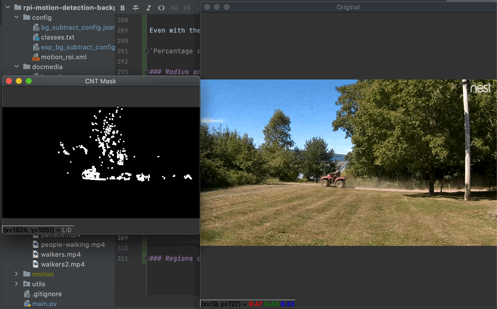

The mask looks the same as the previous one, because the mask is the same but the post processing of the mask with a minimum radius shows us that in the image capture there are no motion areas detected.

The percentage of motion frames also reflects this:

`Percentage of frames with motion: 44.21%`

* min_area_ratio

The `min_area_ratio` is looking for the area of the motion rectangle relative to the area of the frame.  If that exceeds a threshold then it will be considered valid motion.


```text
	"min_radius": 10000,
	"min_area_ratio": 0.001,

```

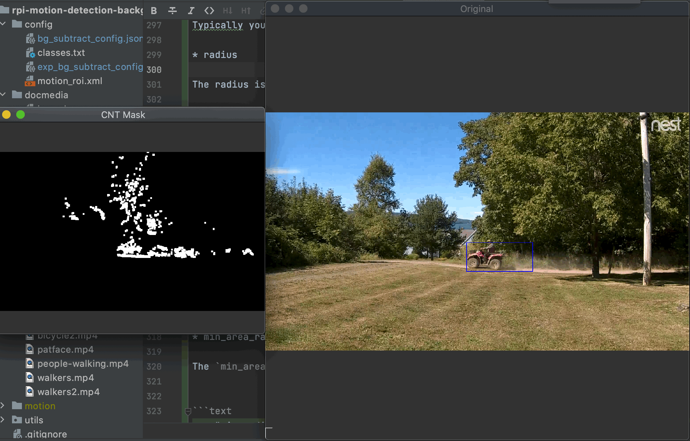

`Percentage of frames with motion: 52.48%`

You can use either or both but which is better will depend upon your situation.

### Regions of Interest

To create Regions of Interest, I used `LabelImg` and saved the file in the PascalVOC format.

Below is an image of what the LabelImg tools looks like:

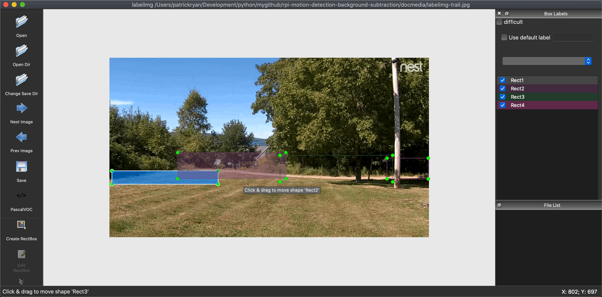

This will produce an xml file that has a definition for the rectangles created in LabelImg.

See: `./config/motion_roi.xml`

This file is read as a command line option and the rectangles are provided to the constructor of the BackgroundSubtractor class.

This class will then mask out so just those rectangles are part in the resulting image and everything outside the region of interest will be black.

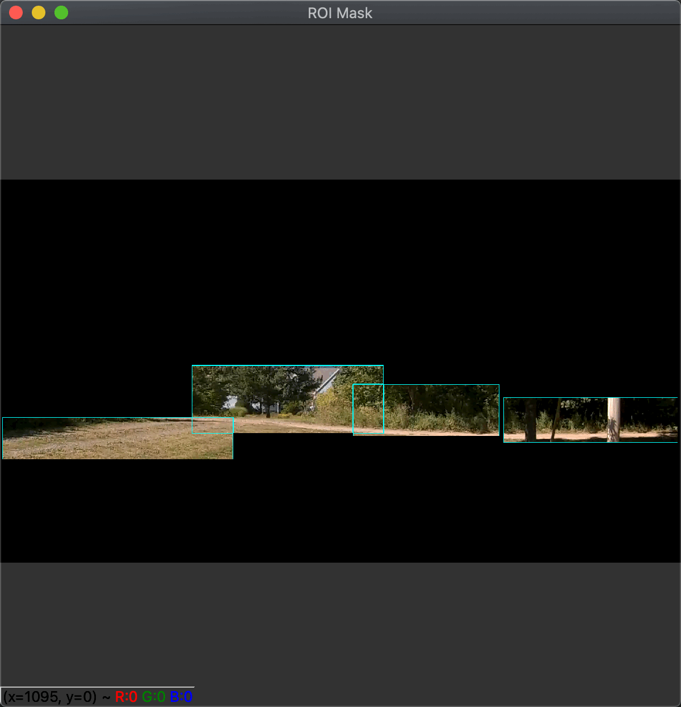

Now if we use this image to perform background subtraction it will only process the part of the image we care about.

When running this version it will look like:

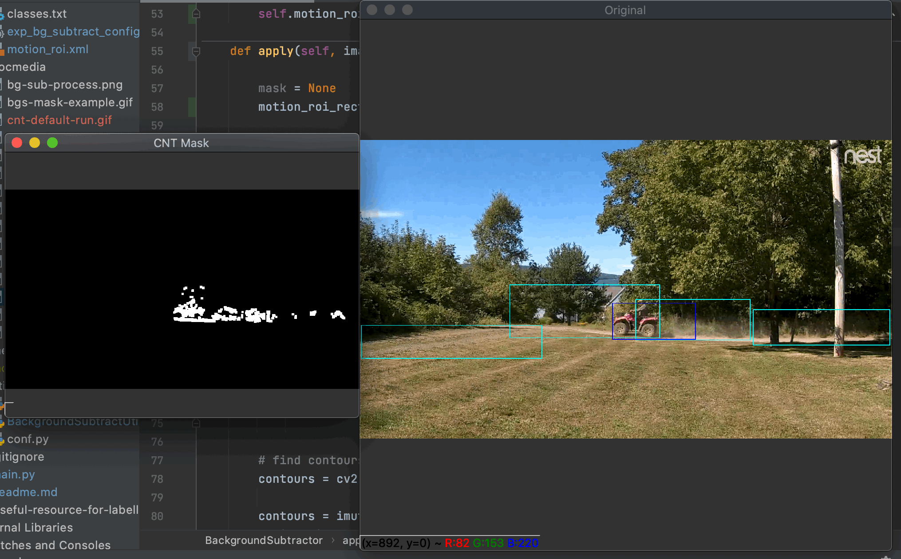

Notice that ONLY the ROI region shows any motion and the percentage of frames with motion is now 18%.

`Percentage of frames with motion: 17.77%`

Your scenario might not lend itself to creating ROI, but if it does it can help tremendously in reducing the motion noise and the processing involved with background subtraction.

## Final Motion Detection 

Note that in all examples below the `--slow-motion` option was used to slow the video when motion was detected to better examine the motion mask and video together.


### ATV


### ATV2


### ATV3


### Bicycle


### Bicycle2


### Walkers


## Running on the RaspberryPI

Make sure you set:

`display_video`, `display_mask`, are set to false.  On the RaspberryPI we are only interested in detecting motion not necessarily processing a large, high resolution video.

Running on my RPi I get 18.18% of the frame had motion, most of which are during the warmup period.

### Startup script

see: `on_reboot.sh`

```shell
#!/bin/bash

source "/home/pi/.virtualenvs/cv2_env/bin/activate"
cd /home/pi/dev/motion
python main.py --bg-config ./config/rpi_headless_bg_subtract_config.json --pascal-voc ./config/condo_background.xml


```

### CRON
----- in terminal --------
sudo crontab -e

at the end of the file

@reboot /full/path/to/script/on_reboot.sh

This project was testing in a front door situation as well as outdoor trail. Indoor even shadows caused false motion detection so a bounding box of the ROI of the front door was created.


## Wrap Up

In this project we looked at Background Subtraction for use with Motion Detection.

Just being able to detect motion and capture images of the motion is interesting enough.  But if we use the motion detection, and a gate to other interesting activities that are heavy resource activities, we can then start to build some very interesting projects on the RaspberryPI or other resource constrained platforms.

