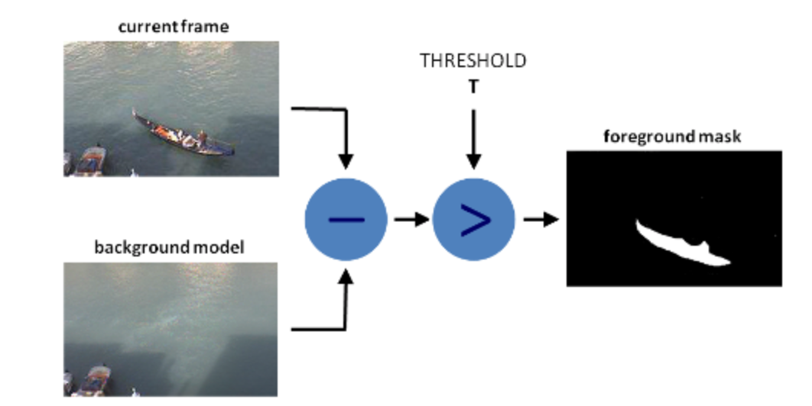

# Motion Detection using Background Subtraction with OpenCV on a RaspberryPI

### Detecting Motion on a multi-use trail to monitor trail usage

Example Background Subtraction Mask


---
## Overview

This is the first of a 2 part blog series.

In this first part we are going to focus on using OpenCV for background subtraction to detect motion.

In the second part of the series, we will use the information we learn here to create a facial recognition alarm system on the RaspberryPI

While this project can be run on a laptop, the goal was to make the processing efficient enough to run on a RaspberryPI 4.

The final project was tested on a RPi4.

## Introduction

In this first part, we are going to monitor trail usage by using 'Background Subtraction' to detect motion from video collected using a Nest cam to monitor trail usage.

Once we have detected motion on the trail, we want to capture some still images that we can review to determine the kind of trail usage.

As a little background on the setup, there is a fixed Nest camera facing the trail.  Clips were taken of ATV, bicycle and walkers using the trail.

An aspect of background subtraction that makes it tricky for outdoor use, is that the background subtraction algorithm assumes that the background is stationary.  If there is any kind of wind, or shadow movement that will confuse the background subtraction algorithm.  Ideally we would like to remove or reduce the detected motion that is not on the trail.


## What is covered

* OpenCV Background Subtraction Algorithms

There are a number of different OpenCV algorithms.  This blog will look at a few of them but you are encouraged to try the others.  As you will see, it is simple to try others.

* View original video footage and the background subtraction mask

* Look at default algorithm parameters and some parameter adjustments

* Use erode and dilate transformations 

To reduce the background subtraction noise.  We will see that by removing the detailed movement, the algorithm speeds up.  This is very important to resource constrained devices such as the RaspberryPI.

* Use LabelImg to create rectangular masks of 'Regions of Interest' or ROIs.

We will generate a PascalVOC formatted file of the regions along the path we would like to look for motion, and then mask out all other areas.  This significantly speeds up the algorithms as only a small portion of the video feed has to be inspected for motion.

Masking out ROI is not always required, or even desirable.  This will depend upon your use case.  For example, in part 2 where we create an facial recognition alarm system we do NOT mask out any regions.


## Attribution

All information is discovered and learned from somewhere and someone else.  The information presented here is no different.  What led me to create this blog and project was the [RaspberryPI for Computer Vision](https://www.pyimagesearch.com/raspberry-pi-for-computer-vision/) series by Dr. Adrian Rosebrock creator of the [PyimageSearch.com](https://pyimagesearch.com) website.

This project is inspired by the Hobbyist Bundle, 'Bird Feeder Monitor'.  Many of the examples in the Hobbyist bundle leverages background subtraction.  I decided to apply what I learned in the Hobbyist bundle to my problem of monitoring trail usage.

```text
@book{rosebrock_rpi4cv,
  author={Rosebrock, Adrian and Hoffman, Dave and McDuffee, David,
	and Thanki, Abhishek and Paul, Sayak},
  title={Raspberry Pi for Computer Vision},
  year={2019},
  edition={1.0.0},
  publisher={PyImageSearch.com}
}

```
If you are interested in Computer Vision particularly as it relates to the RaspberryPI you will not find a better resource, IMHO.

## OpenCV Background Subtraction

[OpenCV Background Subtraction](https://docs.opencv.org/3.4/d1/dc5/tutorial_background_subtraction.html)

Background Subtraction calculates a foreground mask, belonging to the moving objects in a scene, by performing a subtraction of the current frame from the background model.  The background model is created from the static parts of image along with a threshold.

Below is an image from the OpenCV documentation that describes this.



There are a number of [OpenCV algorithms](https://docs.opencv.org/4.5.0/df/d5d/namespacecv_1_1bgsegm.html).  

We will see later, this project is setup to allow for the following Background Subtractor (BS) algorithms:

* CNT

* GMG

* MOG

* GSOC

* LSBP

* MOG2

Specifically this project will look at a subset of these.

Using the BS classes is as easy as passing a frame from a video or webcam to the `apply' method of the class and the algorithm will return a mask.

How mask is created is depended upon the algorithm selected and the parameters used.

For example:

```python
# pseudo code
backSub = cv2.bgsegm.createBackgroundSubtractorCNT()

while True:
    ret, frame = capture.read()
    if frame is None:
        break
    
    # call the apply method with the current frame and get the 
    # mask in return
    fgMask = backSub.apply(frame)
```

We will see that additional process of the mask is required to get good performance.

### Example Masks

We will take a look at 4 different BS algorithms and what the resulting mask looks like.  Keep in mind this is using the default parameters for each algorithm and no other transformations have been applied yet.

Notice that the length of the clips is different because of the processing overhead.


#### GMG
One item to keep in mind with the GMG algorithm, is that by default it takes 120 frames to train the background.  This why it apparently sits idle then kicks.  This initialization frame size can be adjusted when creating the algorithm


